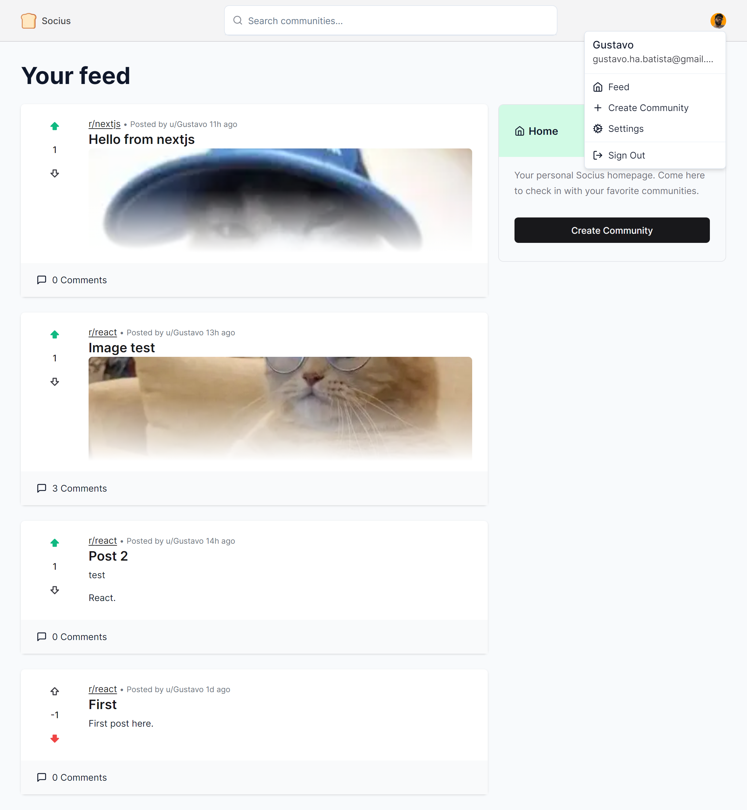

<h1 align="center"> Socius Reddit Clone </h1>

Socius Reddit Clone é um clone do Reddit que permite aos usuários se autenticarem com o Google, criarem e comentarem postagens, e votarem positivo ou negativo em postagens e comentários. Os usuários também podem criar e participar de comunidades e pesquisar por comunidades e postagens.

## 📌 Links

Você pode acessar o projeto em produção [aqui](https://socius-gustavohdab.vercel.app/).

<br>

<p align="center">
  <a href="#-sobre-o-projeto">Sobre o Projeto</a>&nbsp;&nbsp;&nbsp;|&nbsp;&nbsp;&nbsp;
  <a href="#-tecnologias">Tecnologias</a>&nbsp;&nbsp;&nbsp;|&nbsp;&nbsp;&nbsp;
  <a href="#-como-contribuir">Como Contribuir</a>&nbsp;&nbsp;&nbsp;|&nbsp;&nbsp;&nbsp;
  <a href="#-como-iniciar">Como Iniciar</a>&nbsp;&nbsp;&nbsp;|&nbsp;&nbsp;&nbsp;</a>
  <a href="#-preview-do-projeto">Preview do Projeto</a>&nbsp;&nbsp;&nbsp;&nbsp;&nbsp;&nbsp;</a>
</p>

<br>

## 🚀 Tecnologias

Este projeto foi desenvolvido com as seguintes tecnologias:

- [Next.js](https://nextjs.org/) para SSR e geração de sites estáticos.
- [React](https://reactjs.org) para a criação de componentes UI.
- [TypeScript](https://www.typescriptlang.org/) para adicionar tipos estáticos ao JavaScript.
- [TailwindCSS](https://tailwindcss.com/) para estilização.
- [Axios](https://axios-http.com/) para chamadas de API.
- [EditorJS](https://editorjs.io/) para edição de texto.
- [React Hook Form](https://react-hook-form.com/) para gerenciamento de formulários.
- [Next Auth](https://next-auth.js.org/) para autenticação.
- [Prisma](https://www.prisma.io/) para acesso ao banco de dados.
- [Uploadthing](https://uploadthing.com/) e [React Dropzone](https://react-dropzone.js.org/) para manipulação de upload de arquivos.
- [Zod](https://www.npmjs.com/package/zod) para validação de dados.
- E outras bibliotecas e frameworks auxiliares.

## 💻 Sobre o Projeto

O Socius Reddit Clone simula a plataforma Reddit, com algumas funcionalidades adicionais. Além das funcionalidades mencionadas anteriormente, os usuários têm a opção de alterar o nome de usuário, criar postagens em comunidades, comentar postagens em comunidades e votar em postagens e comentários dentro de comunidades.

---

Feito com ♥ por Gustavo Batista :wave: [LinkedIn](https://www.linkedin.com/in/gustavo-h-batista/) e [GitHub](https://github.com/gustavohdab)

---

## 👥 Como Contribuir

1. Faça um fork do projeto.
2. Crie uma nova branch com suas alterações: `git checkout -b my-feature`
3. Salve suas alterações e crie uma mensagem de commit contando o que você fez: `git commit -m "feature: My new feature"`
4. Envie suas alterações: `git push origin my-feature`

## 🚀 Como Iniciar

```bash
# clonar o repositório
git clone https://github.com/gustavohdab/socius
# ir para o repositório e:
npm install && npm run dev
```

## 🖼️ Preview do Projeto

<p align="center">
  
</p>
